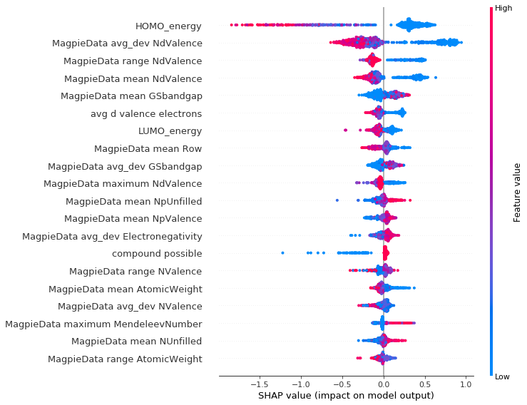

# Explainable materials machine learning

This is a set of notebooks intended to give a quick introductions into some methods for 
building and examining models that could be useful for materials design.

The first notebook `classical-ml` introduces a number of methods for fitting some features
to data on the band gap of materials. The final model that we come to is based strongly on 
[Data-Driven Discovery of Photoactive Quaternary Oxides Using First-Principles Machine Learning](https://pubs.acs.org/doi/abs/10.1021/acs.chemmater.9b01519)

The second notebook `shapley_values_gbtree` introduces the application of [`TreeExplainer`](https://shap.readthedocs.io/en/latest/) to examine how the features of the model contribute to the outcomes. And to help with understanding the predictions that are made.

## Files

* `data` - contains all the data needed to train the models
* `models` - contains a pre-trained decision tree, if you want to skip straight to tutorial 2
* `notebooks` - has the two notebooks 
* `environment.yml` - contains the conda environment that these notebooks were developed in
